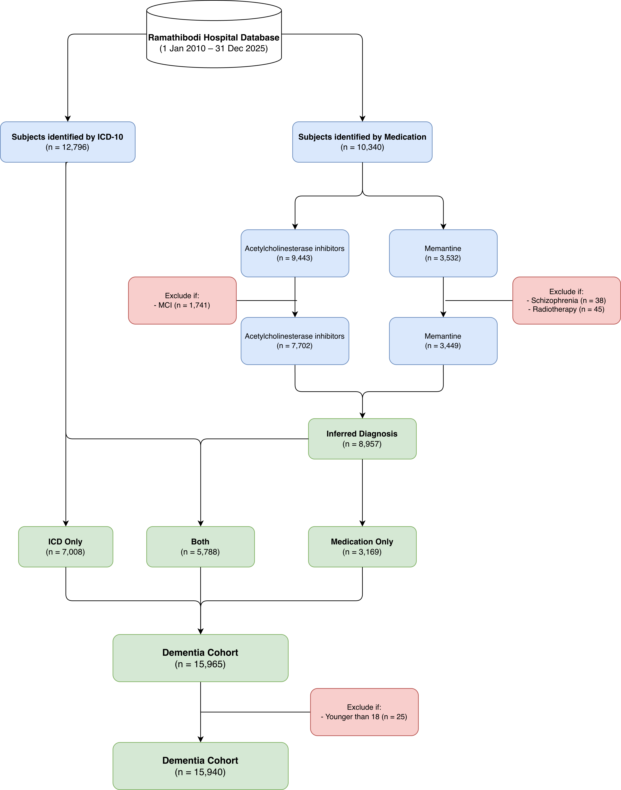
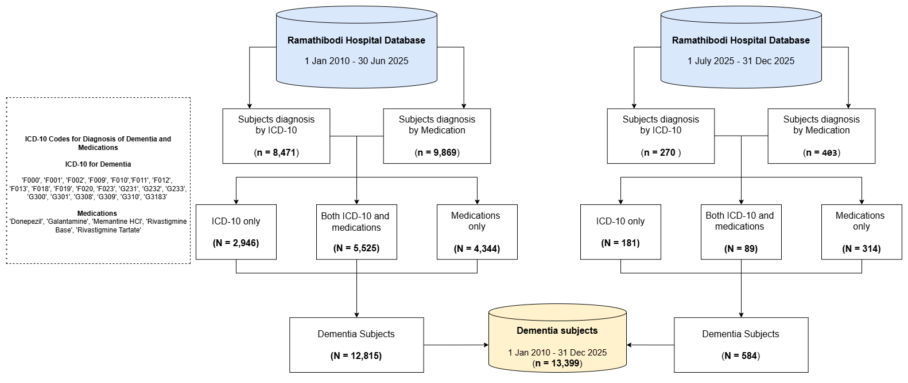
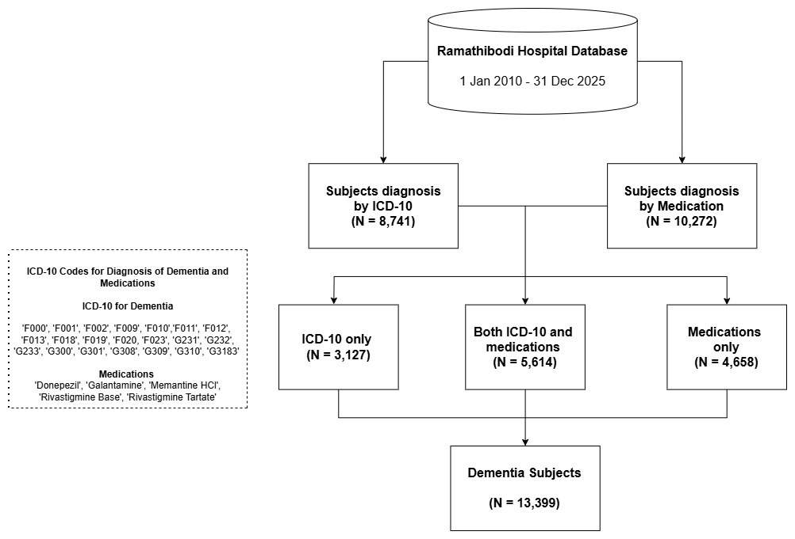
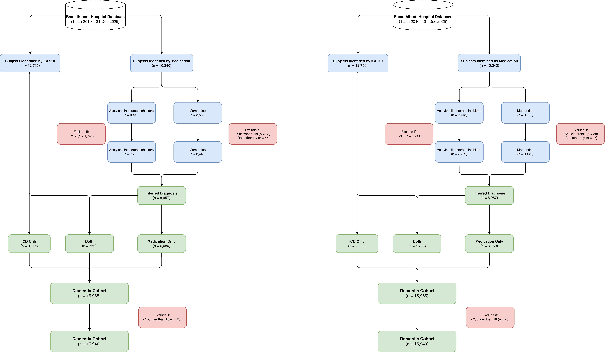

# Dementia Data Warehouse

- **Author:** Htun Teza
- **Date:** 8 May 2026

## Contents
- [Dementia Data Warehouse](#dementia-data-warehouse)
  - [Contents](#contents)
  - [Dementia Data Warehouse](#dementia-data-warehouse-1)
    - [2010-2025/12 (16 years)](#2010-202512-16-years)
      - [Data Flow](#data-flow)
  - [Dementia cohort update](#dementia-cohort-update)
    - [Data Warehouse Timeline](#data-warehouse-timeline)
      - [ETL timeline](#etl-timeline)
      - [Subtypes](#subtypes)
    - [Supplementary](#supplementary)
      - [Code](#code)
      - [Maplist](#maplist)
      - [Data Request](#data-request)
---

## Dementia Data Warehouse

### 2010-2025/12 (16 years)

Documentation on cohort identification procedure can be found [here](cohort_identification.md).

#### Data Flow

---

## Dementia cohort update

### Data Warehouse Timeline

#### ETL timeline

With our latest data extraction (ETL) in December 2025,

- New case update to December 2025 (Bi-Annually)
- Follow up visits update to December 2025 (Quarterly).

<!-- ### Update Summary

#### Cohort Update

 -->

<!-- #### Dementia Cohort (16 years)

 -->

#### Subtypes

As mentioned in cohort identification documentation, patients can be classified by either index diagnosis or final diagnosis. The figure below shows the comparison of two flowcharts grouping patients by index diagnosis (left) and final diagnosis (right). The large shift from Medication only at index to both ICD-10 and Medication at final reflects longitudinal accrual of ICD-10 diagnoses among patients initially identified by medication only. 

### Supplementary

#### Code

The example code used in CEB data warehouse can be found in the code folder.

|Type|Usage|Link|
|---|---|---|
|Cohort identification|Example code for cohort identification|[here](code/cohort_identification.py)|

#### Maplist

The maplist of ICD-10 codes and medication codes used for cohort identification can be found in the maplist folder. 

| Type | Usage | Link |
| --- | --- | --- |
| Dementia (ICD-10) | Cohort identification | [here](maplist/cohort/dementia_icd10_map.csv) |
| Medication (Intrahospital Code) | Cohort identification | [here](maplist/cohort/medication_map.csv) |
| | | |
| MCI (ICD-10) | Exclusion criteria for AChEI | [here](maplist/cohort/mci_icd10_map.csv) |
| Schizophrenia (ICD-10) | Exclusion criteria for Memantine | [here](maplist/cohort/schizophrenia_icd10_map.csv) |
| Clozazpine (Intrahospital Code) | Exclusion criteria for Memantine | [here](maplist/cohort/clozapine_map.csv) |
| Radiotherapy (ICD-9) | Exclusion criteria for Memantine | [here](maplist/cohort/radiotherapy_icd9_map.csv) |
| | | |
| MCI (ICD-10) | Codes under review | [here](maplist/cohort/review_code_map.csv) |
| BPSD (ICD-10) | Codes under review | [here](maplist/cohort/review_code_map.csv) |
| Degenerative / Uncertain (ICD-10) | Codes under review | [here](maplist/cohort/degenerative_uncertain_code_map.csv) |

#### Data Request
More details regarding this and other cohorts can be found [here](https://www.rama.mahidol.ac.th/ceb/CEBdatawarehouse/Data/Dementia) at CEB-RAMA-MU. Data request can be made on the same webpage.